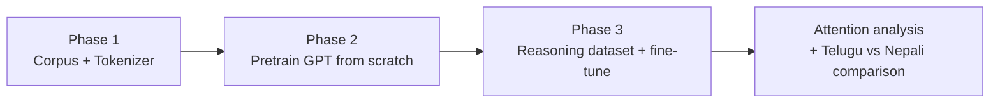

# GPT from Scratch: Telugu and Nepali Language Models

A decoder-only GPT-style Transformer built end to end for two Indic languages: **Telugu** (high-resource, "Model H") and **Nepali** (low-resource, "Model L"). The project covers corpus collection, cleaning and deduplication at the scale of tens of millions of sentences, tokenizer training, pretraining a 12-layer Transformer, evaluation, mechanistic attention analysis, and fine-tuning on a synthetic multi-hop reasoning benchmark.

> Course project (LMA Final Project) by **T Sai Tanooj**.

---

## Highlights

| | Telugu (Model H) | Nepali (Model L) |
|---|---|---|
| Unique sentences after dedup | **60.7M** | **25.6M** |
| Words in corpus | 672.1M | 503.1M |
| Training tokens | **863.8M** | **554.1M** |
| Tokenizer | Unigram SentencePiece, 10K vocab | Unigram SentencePiece, 10K vocab |
| Tokenizer fertility / UNK rate | 1.441 / 0.0% | 1.382 / 0.0% |
| Model | 12-layer, d=384, 8 heads, ~25.3M params | Same architecture |
| Validation cross-entropy | 5.02 (perplexity 151.5, 0.66 BPB) | ≈5.3 |
| Reasoning accuracy, pretrained (zero-shot) | 0.0% | 0.0% |
| Reasoning accuracy, fine-tuned | **81.75%** | **80.9%** |

Key things done in this project:

- Built a streaming, hash-bucketed data pipeline that processes 8 GB corpora and removes about 8.7M (Telugu) and 9.0M (Nepali) duplicate sentences.
- Compared 5K and 10K Unigram tokenizers with intrinsic metrics and chose between them with evidence.
- Implemented a GPT-style Transformer (pre-LN, learned positional embeddings, weight tying) and trained it from scratch for both languages.
- Evaluated with perplexity, bits-per-byte, and generation metrics (BLEU-4, chrF, ROUGE-L, Distinct-n, repeated 3-gram rate) across four decoding strategies.
- Analysed attention across layers (distance, entropy, heatmaps) before and after fine-tuning.
- Designed a six-template multi-hop reasoning dataset with leakage controls, and diagnosed a positional shortcut in it.

---

## Table of Contents

1. [Project Overview](#1-project-overview)
2. [Resources and Downloads](#2-resources-and-downloads)
3. [Phase 1: Data and Tokenization](#3-phase-1-data-and-tokenization)
4. [Phase 2: Pretraining the Transformer](#4-phase-2-pretraining-the-transformer)
5. [Phase 3: Reasoning Fine-tuning](#5-phase-3-reasoning-fine-tuning)
6. [Telugu vs Nepali: Comparative Analysis](#6-telugu-vs-nepali-comparative-analysis)
7. [Limitations and Lessons Learned](#7-limitations-and-lessons-learned)
8. [Metric Glossary](#8-metric-glossary)

---

## 1. Project Overview

The project has three phases, run identically for both languages so the results can be compared across resource tiers.



| Phase | What was done |
|---|---|
| **Phase 1** | Collected, cleaned, deduplicated, and split large Telugu and Nepali corpora. Trained and compared SentencePiece tokenizers. Tokenized the training sets. |
| **Phase 2** | Implemented and pretrained a 12-layer decoder-only Transformer per language. Evaluated language modelling and generation quality, and analysed attention. |
| **Phase 3** | Generated a six-template multi-hop reasoning dataset in each language. Fine-tuned the pretrained models, compared pretrained vs fine-tuned accuracy, and studied how attention changed. |

---

## 2. Resources and Downloads

| Resource | Link |
|---|---|
| Telugu tokenizer files | https://www.kaggle.com/datasets/tanoojtadepalli/telugu-phase2 |
| Nepali tokenizer files | https://www.kaggle.com/datasets/tanoojtadepalli/nepali-phase2 |
| Pretrained Telugu model files | https://www.kaggle.com/datasets/sukaramba/telugu-model-files |
| Pretrained Nepali model files | https://www.kaggle.com/models/saitanoojtadepalli/nepali-models |
| Telugu Phase 3 reasoning dataset | https://www.kaggle.com/datasets/tanoojtadepalli/final-telugu-phase3 |
| Nepali Phase 3 reasoning dataset | https://www.kaggle.com/datasets/tanoojtadepalli/nepali-phase3-dataset |

---

## 3. Phase 1: Data and Tokenization

### 3.1 Dataset collection

Each language's corpus combines **manually collected** data with **existing public datasets**.

**Telugu**

| Type | Source |
|---|---|
| Manual: news | Web-scraped articles from Sakshi, NTV, TV9, and Andhra Jyothy |
| Manual: legislative | Andhra Pradesh Budget 2024 session transcripts |
| Manual: podcasts | Transcripts from Telugu podcasts such as *Raw Talks with VK* |
| Manual: parallel data | Telugu source and target text from Bhashaverse (IIITH) Parquet files |
| Existing | Telugu portion of AI4Bharat **IndicCorp V2** (8 GB, streamed) |

**Nepali**

| Type | Source |
|---|---|
| Manual: news | Setopati articles covering politics, entertainment, and world news |
| Manual: raw text | Large uncleaned Nepali text files collected for processing |
| Existing | Nepali IRIS research dataset and a Hugging Face Nepali corpus (8 GB, streamed) |

### 3.2 Text cleaning

All cleaning was done with regular expressions.

**Telugu**

1. Removed HTML tags
2. Removed URLs and web links
3. Applied Unicode normalization
4. Kept only Telugu characters
5. Collapsed repeated spaces and tabs into one space
6. Collapsed repeated newlines into one newline
7. Added spacing around punctuation
8. Removed extra spaces introduced by the punctuation step

**Nepali**

- Removed HTML tags and URLs
- Applied Unicode **NFC** normalization
- Kept only Nepali characters, spaces, numbers, and basic punctuation
- Removed stray characters and extra tabs and spaces
- Collapsed multiple newlines into one
- Added spaces around punctuation for consistent tokenization
- Stripped leading and trailing spaces

### 3.3 Pipeline

The same pipeline was applied to both languages:

1. Collect text from manual sources and from the large public corpus (streamed, not loaded into memory).
2. Clean the text and split it into **sentence-level** records.
3. Tag each sentence with its source: **M** (manual) or **D** (downloaded).
4. Distribute sentences into **256 MD5-based buckets**. Because identical sentences hash to the same bucket, deduplication can run bucket by bucket without holding the whole corpus in memory.
5. Remove exact duplicate sentences within each bucket.
6. Create an **80/10/10** train, validation, and test split.
7. Train **5K and 10K Unigram SentencePiece** tokenizers on the training data.
8. Evaluate both tokenizers on 5,000 validation sentences (fertility and UNK rate).
9. Select the 10K tokenizer, which had lower fertility and a 0% UNK rate.
10. Tokenize the training corpus.

### 3.4 Why Unigram SentencePiece rather than BPE?

Telugu is morphologically rich. **BPE** merges the most frequent adjacent pairs and does not consider morphological structure, so meaningful morphological segments can be lost. **Unigram** scores multiple candidate segmentations of a word and picks the most probable one. This gives more flexibility in representing the morphological components of Telugu words and can better preserve their structure. The same tokenizer family was used for Nepali for consistency.

### 3.5 Corpus statistics

**Telugu**

| Statistic | Count |
|---|---|
| Manual sentence candidates | 23,272,604 |
| IndicCorp sentence candidates | 46,190,318 |
| Total sentence candidates | 69,462,922 |
| Duplicates removed | 8,735,800 |
| **Total unique sentences** | **60,727,122** |
| Unique manual sentences | 23,154,617 |
| Unique IndicCorp sentences | 37,572,505 |
| Manual word count | 307,468,665 |
| IndicCorp word count | 364,668,963 |
| Total word count | 672,137,628 |
| **Final training tokens** | **863,817,731** |

| Split | Sentences |
|---|---|
| Train | 48,581,452 (80.00%) |
| Validation | 6,069,130 (9.99%) |
| Test | 6,076,540 (10.01%) |

**Nepali**

| Statistic | Count |
|---|---|
| Manual sentence candidates | 3,624,895 |
| Downloaded sentence candidates | 30,963,245 |
| Total sentence candidates | 34,588,140 |
| Duplicates removed | 9,028,670 |
| **Total unique sentences** | **25,559,470** |
| Unique manual sentences | 2,705,965 |
| Unique downloaded sentences | 22,853,505 |
| Manual word count | 135,909,429 |
| Downloaded word count | 367,234,259 |
| Total word count | 503,143,688 |
| **Final training tokens** | **554,121,940** |

| Split | Sentences |
|---|---|
| Train | 20,447,821 (80.00%) |
| Validation | 2,554,861 (10.00%) |
| Test | 2,556,788 (10.00%) |

### 3.6 Tokenizer comparison

| Metric | Telugu 5K | Telugu 10K | Nepali 5K | Nepali 10K |
|---|---|---|---|---|
| Fertility (tokens per word, lower is better) | 1.675 | **1.441** | 1.579 | **1.382** |
| UNK rate | 0.0 | 0.0 | 0.0 | 0.0 |

The 10K vocabulary was selected for both languages.

**Sanity check on token counts.** Multiplying word counts by fertility gives an estimate of the token count:

- Telugu: 307.5M × 1.441 + 364.7M × 1.441 ≈ 968.9M tokens estimated, versus **863.8M** actual training tokens (the estimate covers all splits, while the actual figure is the training split only).
- Nepali: 135.9M × 1.382 + 367.2M × 1.382 ≈ 695.3M tokens estimated, versus **554.1M** actual training tokens.

---

## 4. Phase 2: Pretraining the Transformer

### 4.1 Architecture

Both languages use the same decoder-only (GPT-style) Transformer.

```
Input token ids
   │
   ├─ Token embedding (V × 384)
   ├─ Learned positional embedding (512 × 384)   → added element-wise
   └─ Embedding dropout (0.1)
   │
   ▼
 ┌─────────────────────────────────────────────┐
 │ Transformer block × 12                       │
 │   LayerNorm → Causal multi-head self-attn    │
 │   + residual                                 │
 │   LayerNorm → FFN (384 → 1536 → 384, GELU)   │
 │   + residual                                 │
 │   Dropout 0.1 on attention probs + outputs   │
 └─────────────────────────────────────────────┘
   │
   ▼
 Final LayerNorm → Output projection (tied with token embedding) → logits over V
```

| Component | Design |
|---|---|
| Embeddings | 384-dimensional token embeddings plus **learned absolute positional embeddings** (max length 512), summed, then dropout 0.1 |
| Attention | Multi-head **causal** self-attention (8 heads) with separate Q, K, V projections and no QKV bias |
| Feed-forward | Two-layer position-wise MLP with **GELU**, 384 → 1,536 → 384 |
| Residuals | Around both the attention and feed-forward sublayers |
| Normalization | **Pre-LayerNorm**, applied before each sublayer, for more stable training of deeper stacks |
| Dropout | 0.1 on attention probabilities and on the outputs of both sublayers |
| Output | Final LayerNorm, then a projection to the vocabulary **tied** to the token embedding |

**Why learned positional embeddings?** Vaswani et al. (2017) found learned and sinusoidal positional embeddings perform nearly identically within the trained sequence length. Sinusoidal encodings extrapolate better beyond it, while learned embeddings need chunking for longer inputs. Since the sentences here were short and learned embeddings are simpler to implement, learned embeddings were used.

### 4.2 Configuration

| Parameter | Value |
|---|---|
| Vocabulary size | 10,000 |
| Max sequence length | 512 |
| Model dimension (d_model) | 384 |
| Layers | 12 |
| Attention heads | 8 (head dimension 48) |
| Feed-forward dimension (d_ff) | 1,536 |
| QKV bias | False |
| Dropout | 0.1 |
| Position encoding | Learned absolute |
| Normalization | Pre-LN |
| Tied embeddings | True |

### 4.3 Parameter count (≈25.29M)

| Component | Calculation | Parameters |
|---|---|---|
| Token embedding | 10,000 × 384 | 3,840,000 |
| Positional embedding | 512 × 384 | 196,608 |
| QKV projections (per layer) | 3 × 384² | 442,368 |
| Output projection (per layer) | 384² | 147,456 |
| FFN layer 1 (per layer) | 384 × 1,536 | 589,824 |
| FFN layer 2 (per layer) | 1,536 × 384 | 589,824 |
| LayerNorms (per layer) | 2 × (2 × 384) | 1,536 |
| **Per layer total** | | **1,771,008** |
| All 12 layers | 12 × 1,771,008 | 21,252,096 |
| Final LayerNorm | 2 × 384 | 768 |
| Output projection | Tied with token embedding | 0 |
| **Total** | | **25,289,472** |

Nepali uses the identical configuration.

### 4.4 Telugu (Model H): results

**Training.** The training loss falls steadily from about **9.1 to 4.2** over roughly 33K optimizer steps. Validation loss drops quickly and then flattens near **5.0**, with no significant upturn, so there is no sign of overfitting.

**Validation metrics**

| Metric | Value |
|---|---|
| Cross-entropy | 5.0204 |
| Perplexity | 151.48 |
| Bits-per-byte | 0.6602 |
| Evaluated tokens | 1,638,400 |
| Evaluated UTF-8 bytes | 17,975,776 |

**Generation evaluation across decoding strategies**

| Strategy | BLEU-4 | chrF | ROUGE-L | Distinct-1 | Distinct-2 | Repeated 3-gram % |
|---|---|---|---|---|---|---|
| Greedy | 0.585 | 10.99 | 11.18 | 0.097 | 0.132 | 0.848 |
| Temperature 0.5 | **0.807** | 17.96 | 10.07 | 0.323 | 0.559 | 0.329 |
| Temperature 1.0 | 0.668 | 22.40 | 9.22 | 0.654 | 0.967 | 0.008 |
| Temperature 1.5 | 0.341 | **23.19** | 3.66 | **0.826** | **0.999** | **0.000** |

Greedy decoding is highly repetitive (84.8% repeated 3-grams). Raising the temperature increases diversity and eliminates repetition. Temperature 0.5 gives the best BLEU-4, temperature 1.0 is the best balance of similarity, diversity, and low repetition (Distinct-2 0.967, 0.8% repeated 3-grams), and at 1.5 diversity is highest but BLEU-4 and ROUGE-L drop.

**Attention analysis.** Mean attention distance and entropy follow the same shape across the 12 layers: high in early layers, a sharp drop to a **minimum around layer 6**, and a rise again towards the last layers. Layer 0 attends broadly, with most weight near zero and very high entropy. By layer 11 attention is more distributed and content-driven, with multiple relevant positions attended. One reading of this is that the model first gathers coarse content, then builds morphological and local structure in the middle layers, and finally integrates longer-range dependencies for next-token prediction.

### 4.5 Nepali (Model L): results

**Training.** Training loss falls from about **9.0 to 4.7** (about 16.5K optimizer steps), and validation loss from about **7.6 to 5.3**. Both keep decreasing, but a train-validation gap remains at the end.

**Generation evaluation**

| Strategy | BLEU-4 | chrF | ROUGE-L | Distinct-1 | Distinct-2 | Repeated 3-gram % |
|---|---|---|---|---|---|---|
| Greedy | **1.016** | 15.83 | 11.09 | 0.157 | 0.298 | 0.622 |
| Temperature 0.5 | 0.964 | 20.98 | **11.06** | 0.391 | 0.753 | 0.099 |
| Temperature 1.0 | 0.721 | 20.94 | 8.12 | 0.679 | 0.965 | 0.002 |
| Temperature 1.5 | 0.445 | **21.82** | 3.12 | **0.847** | **1.000** | **0.000** |

The trade-offs mirror Telugu: greedy gives the closest match to reference text but the most repetition (62.2% repeated 3-grams), temperature 1.0 balances diversity and repetition, and temperature 1.5 maximizes diversity at the cost of BLEU-4 and ROUGE-L.

**Attention analysis.** The same layer-wise pattern appears, with a minimum around **layers 6 to 7** and a more moderate rise in later layers than in Telugu. Layer 0 attention is mostly near zero, while layer 11 shows several distinct off-diagonal hotspots. Attention moves from broad, sink-driven patterns in early layers, to focused local attention in the middle, to content-based, longer-range attention in later layers.

---

## 5. Phase 3: Reasoning Fine-tuning

### 5.1 Reasoning dataset

A synthetic dataset of **12,000 examples** (2,000 per template) was generated for each language from six templates:

| Template | Task |
|---|---|
| **T1** Direct Comparison | Compare two explicit numbers and pick the larger or smaller |
| **T2** Greater / Smaller / Equal | Compare two numbers and output one of three balanced labels |
| **T3** 3-Entity Transitive | Infer the relationship between the endpoints of a three-entity chain (two hops) |
| **T4** 4-Entity Multi-Hop | Reconstruct a four-entity chain from shuffled facts (three hops) |
| **T5** Multi-Hop with Distractors | Multi-hop reasoning while ignoring irrelevant facts about chain entities |
| **T6** Mixed Direction | Normalise forward and reverse relations before reasoning over a multi-hop chain |

**Split:** 80/10/10, giving **9,600 train, 1,200 validation, 1,200 test**. Each template contributes 1,600, 200, and 200 examples to the respective splits, so the splits are balanced across templates.

### 5.2 Dataset design decisions

**Shared name pool.** The first version used disjoint names across train, validation, and test. This turned the task into a *name generalisation* problem rather than a reasoning problem. The final version uses **one shared name pool across all splits** and varies only the logical structure, so the real difference between train and test is the reasoning problem itself.

**Preventing leakage across splits.** Two sets are shared across the train, validation, and test generators:

- `seen_prompts` ensures the exact same prompt never appears more than once.
- `seen_problem_keys` stores the template, attribute, ordered entities, question type, and numeric values (for T1 and T2). This prevents the same *logical* problem from being reused even when the wording, fact order, or distractors change, so no underlying problem appears in more than one split.

### 5.3 Telugu fine-tuning

| Epoch | Train loss | Validation loss |
|---|---|---|
| 1 | 1.6022 | 0.2408 |
| 2 | 0.1975 | **0.1539** |
| 3 | 0.1496 | 0.1573 |

Epoch 2 was chosen as the best checkpoint by validation loss. The small validation increase in epoch 3 suggests more training would not have helped.

**Test accuracy, pretrained vs fine-tuned (200 test examples per template)**

| Template | Pretrained | Fine-tuned |
|---|---|---|
| T1 | 0.0 | 0.565 |
| T2 | 0.0 | 0.340 |
| T3 | 0.0 | 1.000 |
| T4 | 0.0 | 1.000 |
| T5 | 0.0 | 1.000 |
| T6 | 0.0 | 1.000 |
| **Overall** | **0.0** | **0.8175** |

**Attention findings (Telugu)**

1. Layer 1 heatmaps are almost identical before and after fine-tuning.
2. In layer 12, the pretrained model's attention is spread out with no clear focus. After fine-tuning, a **sharp bright stripe** appears at one token near the end, in the question line.
3. Fine-tuned attention entropy falls below the pretrained model's from about layer 7 onward, so later layers are more focused.
4. Fine-tuned attention distance is **shorter** than pretrained in the late layers. Together with point 2, this indicates the model is pulling information from the question rather than from the fact sentences (see [Limitations](#7-limitations-and-lessons-learned)).

### 5.4 Nepali fine-tuning

Fine-tuning loss converged cleanly to about **0.15** by epoch 3, without the late-epoch validation uptick seen in Telugu.

**Test accuracy, pretrained vs fine-tuned**

| Template | Pretrained | Fine-tuned |
|---|---|---|
| T1 | 0.0 | 0.540 |
| T2 | 0.0 | 0.315 |
| T3 | 0.0 | 1.000 |
| T4 | 0.0 | 1.000 |
| T5 | 0.0 | 1.000 |
| T6 | 0.0 | 1.000 |
| **Overall** | **0.0** | **0.809** (971 / 1,200) |

**Attention findings (Nepali)**

1. Layer 1 heatmaps are almost identical before and after fine-tuning, as in Telugu.
2. In layer 12, fine-tuning splits attention across a few spots in the question area, instead of a single sharp stripe as in Telugu.
3. Fine-tuned entropy drops far below pretrained through the middle layers (down to about 0.4 at layer 7) but climbs back to about **0.81** at layer 12, nearly matching the pretrained value (about 0.90). Telugu's fine-tuned attention stayed clearly sharper through layer 12.
4. Fine-tuned attention distance is **longer** than pretrained from layer 6 onward, ending at about **15.8 tokens vs 13.1** at layer 12. This is the opposite of Telugu and suggests the Nepali model may reach back further, possibly towards the fact sentences.

---

## 6. Telugu vs Nepali: Comparative Analysis

**Data scale and quality.** Telugu used 60.7M unique sentences (863.8M tokens) versus Nepali's 25.6M sentences (554.1M tokens). Nepali needed more crawling and had no dedicated human reviewer, so noisy or machine-translated text was harder to filter out. Despite passing the same automated checks, the Nepali corpus likely retained more unverified, lower-quality data.

**Language modelling vs reasoning.** The larger Telugu corpus gave a better validation loss (5.02 vs about 5.3), but both models performed almost identically on reasoning (81.75% vs 80.9%). Both scored 100% on T3 to T6 and struggled similarly on T1 and T2. Nepali's fine-tuning loss also converged more cleanly.

**What limited the lower-resource model?** Not the tokenizer. Nepali's fertility (1.382) and UNK rate (0%) were comparable to or better than Telugu's. The bottleneck was **corpus composition**: little diverse, high-quality manual data and heavy reliance on unverified crawled web text.

**Supporting evidence.** Nepali's validation loss plateaus higher than Telugu's. The attention analysis also shows Telugu's late layers recovering longer-range attention more sharply (about 7.4 tokens by layer 9) than Nepali's (about 6.0 tokens by layer 11).

---

## 7. Limitations and Lessons Learned

- **Positional shortcut in the reasoning dataset.** Both models hit exactly 100% on T3 to T6 and the Telugu model's late-layer attention locks onto a token in the question rather than the facts. Together these indicate the generator leaves a structural cue the model can exploit without genuinely chaining the facts. Fixing this (for example by randomizing fact order and answer positions more aggressively) is the main next step before treating T3 to T6 scores as evidence of reasoning.
- **T1 and T2 are the real test.** These templates need actual numeric comparison, and accuracy there (34% to 56%) shows the small models learn it only partially. T2 is a 3-way classification, so chance is about 33%, and the Telugu score of 34% is close to chance.
- **Small models and small budget.** At about 25M parameters and a few hundred million tokens, perplexity stays above 150 and generation quality is limited.
- **Nepali data quality.** Without human review of crawled and downloaded text, noise and machine-translated content likely remain.
- **Attention interpretations are qualitative.** The conclusions drawn from heatmaps, entropy, and distance are suggestive, not causal.
- **Lesson on dataset design.** Disjoint names across splits turned the task into name generalisation, and a shared name pool plus problem-level leakage keys was needed to test reasoning itself.

---

## 8. Metric Glossary

| Metric | Meaning |
|---|---|
| **Fertility** | Average number of tokens produced per word. Lower means the tokenizer represents the language more compactly. |
| **UNK rate** | Fraction of tokens that map to the unknown token. |
| **Cross-entropy / perplexity** | Next-token loss and its exponential. Perplexity of about 151 means the model is as uncertain as a uniform choice among roughly 151 tokens. |
| **Bits-per-byte (BPB)** | Cross-entropy normalised by UTF-8 bytes, which makes models with different tokenizers comparable. |
| **BLEU-4 / chrF / ROUGE-L** | Overlap-based similarity between generated and reference text (word 4-grams, character n-grams, longest common subsequence). |
| **Distinct-1 / Distinct-2** | Ratio of unique unigrams or bigrams in generated text, a measure of diversity. |
| **Repeated 3-gram %** | Share of repeated trigrams in generated text, a measure of degeneration and repetition. |
| **Attention distance** | Mean query-key distance (in tokens) weighted by attention. |
| **Attention entropy** | How spread out attention is. Low entropy means sharply focused attention. |
